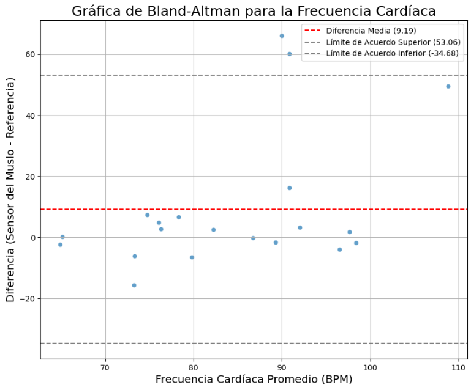
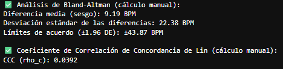

# Validacion-Bioestadistica-de-Sensores-Cardiacos-de-Muslo 🦵🫀
Este proyecto de bioestadística y ciencia de datos presenta un pipeline completo para la validación de un dispositivo de medición de frecuencia cardíaca basado en sensores de muslo. A través de un riguroso análisis de concordancia, se evalúa si este método experimental puede ser un sustituto viable para el electrocardiograma (ECG) clínico, considerado el "estándar de oro".  

El objetivo principal es demostrar la fiabilidad y concordancia de las mediciones de frecuencia cardíaca del sensor del muslo en comparación con las de un dispositivo de ECG de referencia. Este análisis es fundamental para la validación de tecnologías de salud portátiles.  

## Fuente de Datos 💾

Este conjunto de datos está disponible públicamente para investigación. Los detalles se describen las siguientes citaciones. Importante, incluye esta cita si planeas usar esta base de datos:

> Silva, A. S., Plácido da Silva, H., Correia, M., Gonçalves da Costa, A. C., & Laranjo, S. (2025). tOLIet: Single-lead Thigh-based Electrocardiography Using Polimeric Dry Electrodes (version 1.0.0). PhysioNet. RRID:SCR_007345. https://doi.org/10.13026/v66k-sk82

> Goldberger, A., Amaral, L., Glass, L., Hausdorff, J., Ivanov, P. C., Mark, R., ... & Stanley, H. E. (2000). PhysioBank, PhysioToolkit, and PhysioNet: Components of a new research resource for complex physiologic signals. Circulation [Online]. 101 (23), pp. e215–e220. RRID:SCR_007345.

## Tecnologias usadas 🐍
-   Pandas & NumPy: Para la carga, limpieza, transformación y análisis de los datos. Se utilizaron para manejar estructuras de datos complejas y realizar cálculos numéricos eficientes.   
-   xmltodict: Para la correcta lectura y conversión de los archivos XML de los datos de referencia en un formato de diccionario manejable.  
-   BioSPPy: Librería especializada en el procesamiento de señales fisiológicas. Se empleó para la detección de latidos (rpeaks) y la extracción de biomarcadores clave, como la frecuencia cardíaca.  
-   Matplotlib & Seaborn: Para la visualización de los resultados, incluyendo la gráfica de Bland-Altman, que es el centro del análisis de concordancia.    

## Consideraciones en Instalación ⚙️

Para configurar y ejecutar este proyecto, necesitas las siguientes librerías de Python. Se recomienda usar un entorno virtual (conda o venv) para gestionar las dependencias.  

bash  
    ```
    pip install pandas numpy matplotlib seaborn xmltodict biosppy
    ```  

## Nota ⚠️
Para el manejo de este tipo de datos si bien son en excel, el formato en como estan distribuidos no permite que todo sea claro en primera vista, por lo que se debe considerar una estrategia (incluida en el script) para poder procesarlos segun los datos que se tengan y cuales falten. La eficiencia y cuidado para inciar el proyecto es crucial para que puedas hacer las pruebas y aplicaciones necesarias.     

## Ejemplo de Uso 📎

El pipeline de análisis se construyó para procesar los datos de ambos dispositivos, extraer los biomarcadores de frecuencia cardíaca y, finalmente, comparar su concordancia, esto con sus debidos pasos explicitos en el archivo .py  

Fiabilidad de la Señal del Sensor del Muslo: mediante la medida de tasa de éxito de procesamiento se logró extraer la frecuencia cardíaca del sensor del muslo en el 96.55% de los pacientes. En el 3.45% restante, la señal fue demasiado débil o ruidosa, lo que impidió la detección de latidos; y podriamos estar contemplando una limitación en la fiabilidad del sensor.   


Análisis de Concordancia Bioestadística: se realizó en los pacientes donde el procesamiento fue exitoso y podemos interpretarlos mediante 2 calculos clave:  
-   Gráfica de Bland-Altman.- La gráfica reveló una falta de acuerdo significativa entre los dos métodos. Se identificó un sesgo positivo con una diferencia media de +9.19 BPM, lo que indica que el sensor del muslo tiende a sobreestimar la frecuencia cardíaca. Los límites de acuerdo muy amplios (±43.87 BPM) muestran que la diferencia entre ambas mediciones puede ser drásticamente grande.  
-   Coeficiente de Concordancia de Lin (CCC).-  El valor numérico de la concordancia fue extremadamente bajo, confirmando la falta de acuerdo (0.0392), valor tan cercano a cero indica que las mediciones de los dos dispositivos no son intercambiables a primera vista lo cual sugiere mas ensayos y datos para evaluación.  





Podemos decir que si bien el sensor del muslo puede registrar una señal en la mayoría de los casos, no es un sustituto viable ni fiable para un dispositivo de ECG clínico en la medición de la frecuencia cardíaca. La falta de fiabilidad del procesamiento y, más importante aún, la pobre concordancia de las mediciones solo apuntan a que es importante la continuación de este tipo de estudios para lograr una mejora aplicable en la clinica.  

## Contribuciones 🖨️

Si te interesa contribuir a este proyecto o usarlo independiente, considera:  
-   Hacer un "fork" del repositorio.
-   Crear una nueva rama (`git checkout -b feature/su-caracteristica`).
-   Realizar tus cambios y "commiteelos" (`git commit -am 'Agrega nueva característica'`).
-   Subir los cambios a la rama (`git push origin feature/su-caracteristica`).
-   Abrir un "Pull Request".

## Licencia 📜

Este proyecto está bajo la Licencia MIT. Consulta el archivo LICENSE (si aplica) para más detalles.


[English Version](README.en.md)

 

